# README

## Overview

The goal of this project was to implement and improve the results of a recent paper by Jujie Wang and Jing Liu titled "Two‑Stage Deep Ensemble Paradigm Based on Optimal Multi‑scale Decomposition and Multi‑factor Analysis for Stock Price Prediction"[1](#Wang) The paper proposed a stock price prediction algorithm which consists 
of significant data preprocessing followed by a Bidirectional Gated Recurrent 
Unit (BiGRU) prediction model. **By improving the frequency BiGRU models, the frequency predictions were sufficiently accurate to remove the final BiGRU integration model, outperforming the original paper and all 7 other models compared in the paper in all three error metrics.**

The data preprocessing consists of two distinct stages, followed by the prediction stage:
1. Optimal Multi-Scale Decomposition
    - The target variable (Close price) is first decomposed using Single Spectrum Analysis (SSA). To extract the meaningful frequencies of the data and reduce noise, only the first three components are retained. These components are reconstructed to produce a denoised version of the close price.
    - The denoised close price is then decomposed into the optimal number of modes via Variational Mode Decomposition (VMD). The optimal number of modes is determined algorithmically, instead of manual selection. Starting at two modes, the algorithm computes the Sample Entropy[10](#sampen) (SampEn) of the adjacent modes. If the SampEn is sufficiently similar between adjacent modes, the algorithm stops and selects the number of modes as the current number of modes. Otherwise, the algorithm continues to add modes until the difference in SampEn reaches the necessary threshold.
    - The VMD decomposition is then split into "High Frequency" and "Low Frequency" by calculating the Approximate Entropy[9](#apen) (ApEn) of each mode. Modes with ApEn greater than the mean ApEn are classified as "High Frequency" and the rest are classified as "Low Frequency".
    - The "High Frequency" and "Low Frequency" modes are then each reconstructed to produce the denoised close price optimally decomposed by frequency.
2. Multivariate Analysis
    - For each of the "High Frequency" and "Low Frequency" timeseries, 15 variables are considered for multivariate analysis. These variables include the open, high, low, 5-day moving average (MA), 10-day MA, 20-day exponential MA, Bollinger Band highs, Bollinger Band lows, William's variable accumulation distribution, Chaikin A/D line, Chaikin A/D oscillator, on-balance volume, time series forcast, commodity channel index, and moving average convergence divergence.
    - Only variables which both pass the Spearman correlation coefficient test (when the *p*-value is less than 0.05) and have a mutual information (MI) indicator greater than the mean are further considered in the model.
    - A Principal Component Analysis (PCA) is then performed on the selected variables to reduce the dimensionality of the data.
3. Prediction
    - For each frequency, a separate BiGRU model is then trained. The PCA-transformed data along with the respective frequency with a first-order lag is used as input to the BiGRU model. The model is trained to predict the close price of the next day. A BiGRU size of 512 units was selected to balance performance and training efficiency. Each BiGRU is trained to minimize mean square error (MSE) and tested on the last 20% of the data.
    - For the final prediction, a third BiGRU model takes both frequency predictions as input and predicts the final close price.

## Novel Contributions

The original paper proposed a two-step BiGRU integration model for the prediction stage. I found that the model could be improved in two key areas:
1. **Dropout Layer**: The original paper did not include a dropout layer in the BiGRU model. I found that adding a dropout layer between the BiGRU and dense prediction layer significantly improved the performance of the low-frequency prediction model. The dropout layer reduced overfitting and allowed the model to better capture the long patterns in the data.
2. **Direct Summation of Frequencies**: The improved performance from dropout layers at the frequency level resulted in highly accurate frequency predictions. Since the original signal can be reconstructed by summing the low-frequency and high-frequency series, I found that the final prediction model could be simplified by removing the final BiGRU layer and instead directly summing the low-frequency and high-frequency predictions. This reduced the complexity of the model and improved the Root Mean Square Error (RMSE), Mean Absolute Error (MAE), and Mean Absolute Percentage Error (MAPE) for the SZI index, *with all three metrics outperforming the results reported in the original paper*. 

## Results

### SPY

The SPY prices from January 1, 2012 to January 1, 2023 were used as a sample stock. The data was split into training and testing sets with a 80/20 split.

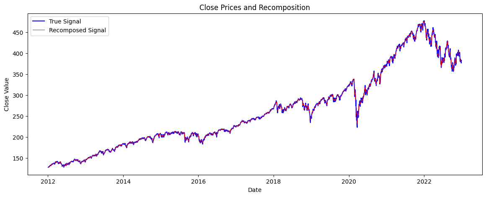

The initial closing prices of the SPY stock are shown above, along with the recomposed signal after SSA was performed. 

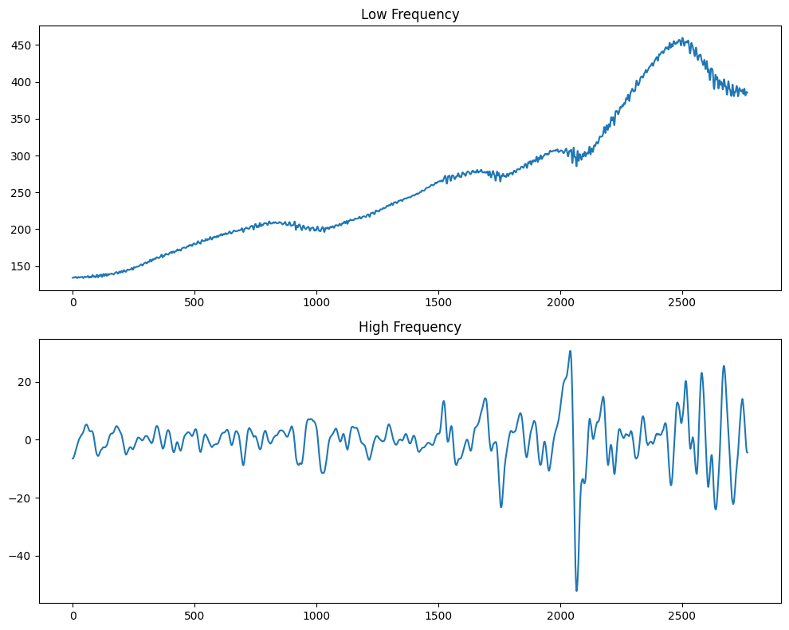

The frequency decompositions of the SPY stock are shown above. The optimal number of modes for VMD decomposition was 5. Per ApEn scores, the low frequency was reconstructed from imf1, imf4, imf5, and the high frequency was reconstructed from imf2 and imf3.

For the high frequency data, the following variables were retained: open, high, low, MA5, MA10, EMA20, BOLL_high, BOLL_low, OBV, TSF, and MACD. The low frequency data retained all of the above except MACD. The SPY data varied significantly from SZI and the results in the paper in that, through PCA, only 1 component was retained for the low frequency and 2 components for the high frequency while retaining >95% of the variance. The PCA-transformed data was then used as input to the BiGRU models.

**High-Frequency BiGRU Prediction Model:**
| Layer | Output Shape | Param # |
| --- | --- | --- |
| Bidirectional GRU | (None, 10, 1024) | 1,588,224 |
| Dropout | (None, 10, 1024) | 0 |
| Dense | (None, 10, 1) | 1,025 |

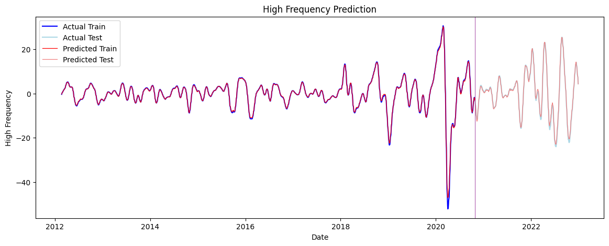

**Low-Frequency BiGRU Prediction Model:**
| Layer | Output Shape | Param # |
| --- | --- | --- |
| Bidirectional GRU | (None, 10, 1024) | 1,585,152 |
| Dropout | (None, 10, 1024) | 0 |
| Dense | (None, 10) | 1,025 |

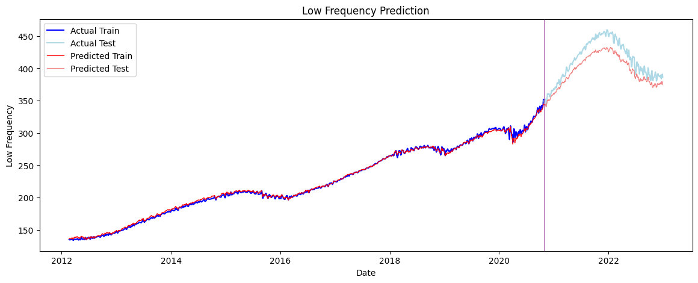

**Final BiGRU Prediction Model:**
| Layer | Output Shape | Param # |
| --- | --- | --- |
| Bidirectional GRU | (None, 1024) | 1,585,152 |
| Dense | (None, 1) | 1,025 |

Although Wang and Liu used just one BiGRU layer followed by the dense prediction layer, I found that the low- and high-frequency predictions were significantly improved by adding a dropout layer. The integration model did not benefit from the dropout layer. The models were trained for 20 epochs with a batch size of 16, as well as an early stopping callback to reduce overfitting. Training locally took approximately 2s per epoch.

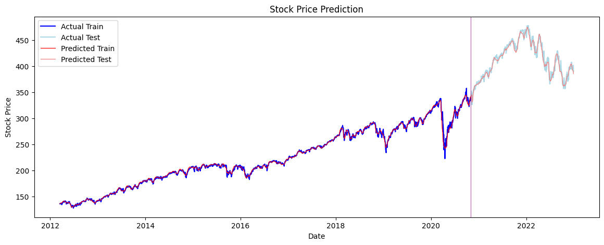

### Alternative Prediction Method

Since the low- and high-frequencies were modeled with such high accuracy with the improved BiGRU architecture, directly summing the two frequency predictions resulted in even lower error rates:

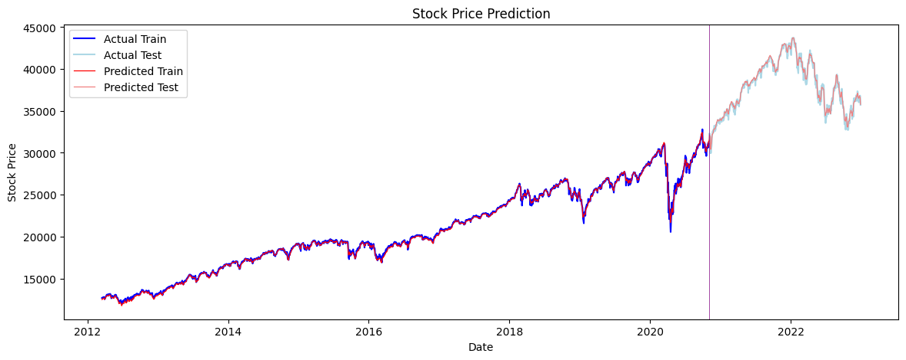

The numerical results are reported in the table below:

| Model | MAE | RMSE | MAPE (%) |
| --- | --- | --- | --- |
| SSA-VMD-MFA-BiGRU | 4.3789 | 5.6107 | 1.0599 |
| Improved SSA-VMD-MFA-BiGRU | 2.9181 | 3.8153 | 0.7172 |

The direct summation technique outperformed the SSA-VMD-MFA-BiGRU model by Wang and Liu in all three metrics.

### SZI

To compare performance with the original paper, the Shenzhen Component Index (SZI) prices from October 28th, 2014 to October 28th, 2022 were used as a sample stock. As in the paper, the optimal VMD decomposition was 7 modes. Imf4 to imf7 were used for high frequency and imf1 to imf3 were used for low frequency. The same high-frequency variables from the SPY data were retained except for the high Bollinger Bands, which were not retained. The low-frequency variables were the same as the SPY data. PCA was performed on the high-frequency data with 3 components retained and the low-frequency data with just 2 components retained. The prediction steps were the same as used in SPY.

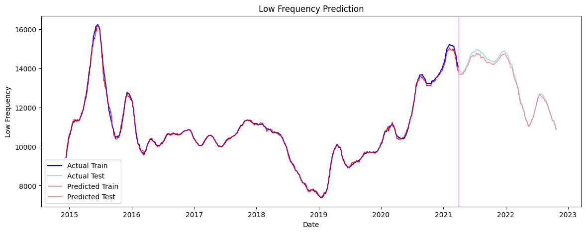

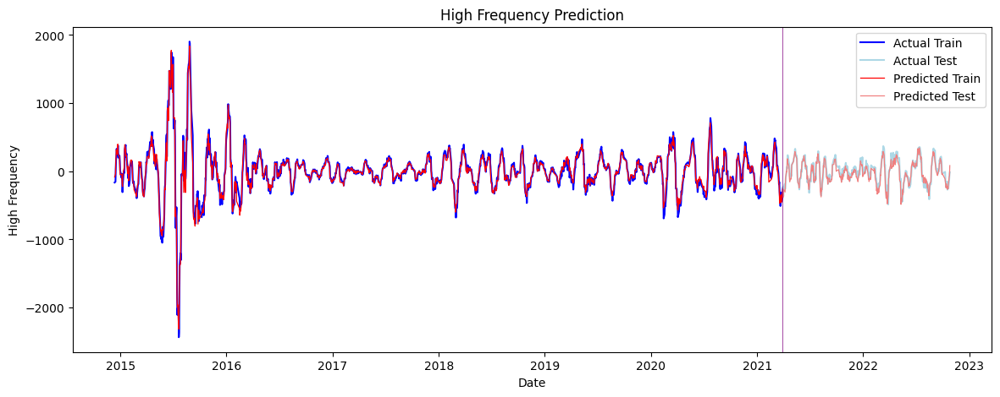

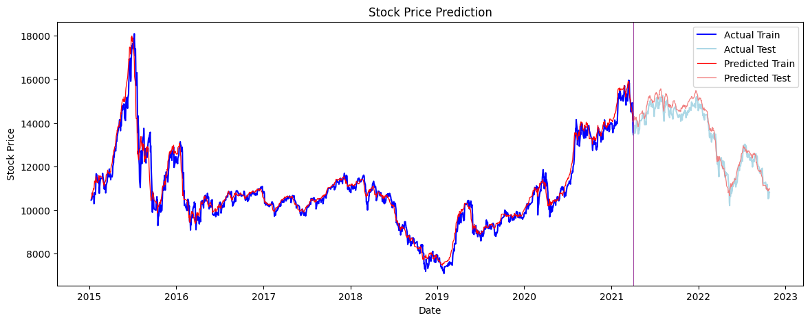

For some unknown reason, the SZI final prediction did not quite achieve the error reported by Wang and Liu. However, the direct summation technique outperformed the original paper in all three metrics, as well as each GRU and LSTM model compared in the paper:

| Model | MAE | RMSE | MAPE (%) |
| --- | --- | --- | --- |
| GRU[2](#gru)               | 221.3521 | 290.9207 | 1.6643 |
| CEEMDAN-LSTM[3](#ceemdan)      | 223.2584 | 281.5606 | 1.6427 |
| SSA-VMD-MFA-BiGRU | 171.1673 | 221.2086 | 1.2796 |
| Improved SSA-VMD-MFA-BiGRU | 160.1349| 190.2766| 1.1747 |
| SSA-SVR[4](#ssa-svr)           | 446.6226 | 486.6464 | 3.9549 |
| CNN-BILSTM[5](#cnn-bilstm)        | 479.4441 | 588.2834 | 4.6337 |
| SSA-BIGRU[6](#ssa-bigru)         | 187.7221 | 247.5064 | 1.4110 |
| VMD-LSTM[7](#vmd-lstm)          | 183.1706 | 235.6836 | 1.3634 | 
| VDM-SE-GRU[8](#vmd-se-gru)        | 178.0437 | 230.4729 | 1.3526 |

### SSEC

The other stock used for comparison in the paper was the Shanghai Stock Exchange Composite Index (SSEC) from October 28th, 2014 to October 28th, 2022. Similarly results followed, with the direct summation technique outperforming the original paper in all three metrics:

**Original prediction method by Wang and Liu**
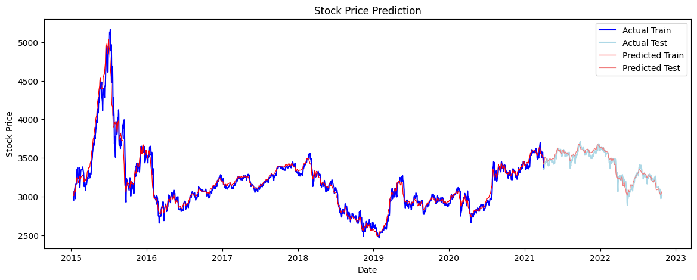

**Direct summation prediction method**
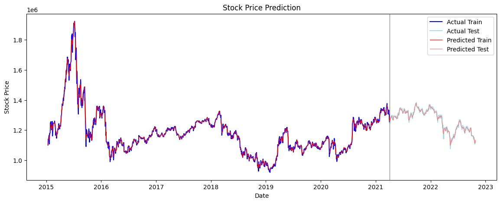

| Model | MAE | RMSE | MAPE (%) |
| --- | --- | --- | --- |
| GRU[2](#gru)                   | 37.3347 | 50.9810 | 1.1155 |
| CEEMDAN-LSTM[3](#ceemdan)      | 102.4273 | 123.4081 | 3.0580 |
| SSA-VMD-MFA-BiGRU                         | 29.9973 | 39.3508 | 0.8946 |
| Improved SSA-VMD-MFA-BiGRU | 16.2963| 20.8189| 0.4832 |
| SSA-SVR[4](#ssa-svr)           | 109.1372 | 117.2263 |  3.3783 |
| CNN-BILSTM[5](#cnn-bilstm)     | 133.8181 | 167.2553 |  4.5655 |
| SSA-BIGRU[6](#ssa-bigru)       | 76.6564  | 89.0099  | 2.2300 |
| VMD-LSTM[7](#vmd-lstm)         | 32.7635 | 41.5849 | 0.9680 | 
| VDM-SE-GRU[8](#vmd-se-gru)     | 30.5862 | 39.5800 | 0.9073 |

## Citations

<a name="#Wang">1</a> Wang, J., Liu, J. Two-Stage Deep Ensemble Paradigm Based on Optimal Multi-scale Decomposition and Multi-factor Analysis for Stock Price Prediction. Cogn Comput 16, 243–264 (2024). https://doi.org/10.1007/s12559-023-10203-x

<a name="#gru">2</a> Saud AS, Shakya S. Analysis of look back period for stock price prediction with RNN variants: a case study on banking sector of NEPSE. Procedia Comput Sci. 2020. https://doi.org/10.1016/j.procs.2020.03.419.

<a name="#ceemdan">3</a> Lin Y, Lin ZX, Liao Y, Li YZh, Xu JL, Yan Y. Forecasting the realized volatility of stock price index: a hybrid model integrating CEEMDAN and LSTM. Expert Syst Appl. 2022. https://doi.org/10.1016/j.eswa.2022.117736.

<a name="#ssa-svr">4</a> Lahmiri S. Minute-ahead stock price forecasting based on singular spectrum analysis and support vector regression. Appl Math Comput. 2017. https://doi.org/10.1016/j.amc.2017.09.049.

<a name="#cnn-bilstm">5</a> Barua R, Sharma AK. Dynamic Black Litterman portfolios with views derived via CNN-BiLSTM predictions. Financ Res Lett. 2022. https://doi.org/10.1016/j.frl.2022.103111.

<a name="#ssa-bigru">6</a> Li XCh, Ma XF, Xiao FCh, Xiao C, Wang F, Zhang Sh. Timeseries production forecasting method based on the integration of Bidirectional Gated Recurrent Unit (Bi-GRU) network and Sparrow Search Algorithm (SSA). J Petrol Sci Eng. 2021. https://doi.org/10.1016/j.petrol.2021.109309.

<a name="#vmd-lstm">7</a> Yu YY, Lin Y, Hou XP, Zhang X. Novel optimization approach for realized volatility forecast of stock price index based on deep reinforcement learning model. Expert Syst Appl. 2023. https://doi.org/10.1016/j.eswa.2023.120880.

<a name="#vmd-se-gru">8</a> Zhang SQ, Luo J, Wang SY, Liu F. Oil price forecasting: a hybrid GRU neural network based on decomposition–reconstruction methods. Expert Syst Appl. 2023. https://doi.org/10.1016/j.eswa.2023.119617.

<a name='#apen'>9</a> Wikipedia contributors. (2023, September 5). Approximate entropy. In Wikipedia, The Free Encyclopedia. Retrieved 01:38, May 31, 2024, from https://en.wikipedia.org/w/index.php?title=Approximate_entropy&oldid=1173919176

<a name='#sampen'>10</a> Wikipedia contributors. (2024, March 14). Sample entropy. In Wikipedia, The Free Encyclopedia. Retrieved 01:41, May 31, 2024, from https://en.wikipedia.org/w/index.php?title=Sample_entropy&oldid=1213663278

Data was sourced from Yahoo Finance.